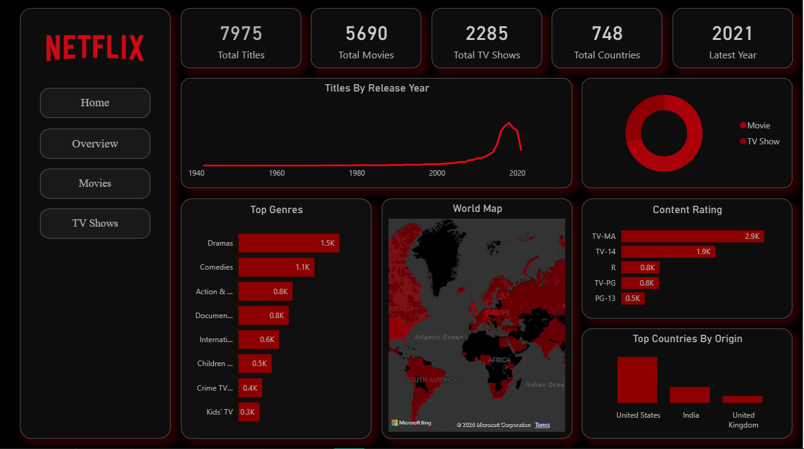
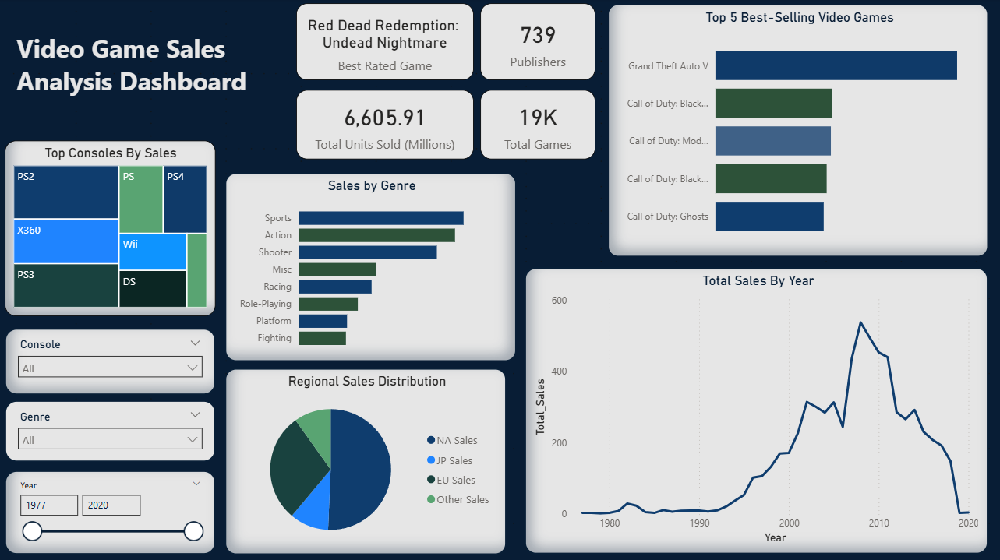

# Power BI Dashboards

This directory contains interactive Power BI dashboard projects developed for data analysis and visualization practice.

Each project demonstrates:

- Data cleaning and transformation using Power Query
- Data modeling and relationship building
- DAX measures and calculated columns
- KPI development
- Interactive multi-page dashboard design
- Insight-driven storytelling through visualizations

## Projects

### 1. Netflix Content Analysis
Interactive dashboard analyzing Movies and TV Shows by release trends, genres, ratings, duration, seasons, and country of origin.

[View Project Folder](./netflix_content_analysis)

### Preview

---

### 2. Global Layoff Analysis
Dashboard exploring global layoff trends, industry impact, company-level distribution, and time-based analysis.

[View Project Folder](./global_layoff_analysis)

### Preview

---

### 3. Video Game Sales Analysis
Dashboard analyzing global video game sales by platform, genre, region, publisher, and release trends.

[View Project Folder](./videogame_sales_analysis)

---

Each folder contains:
- Power BI (.pbix) file
- Dataset (if applicable)
- Preview images
- Project-specific README
