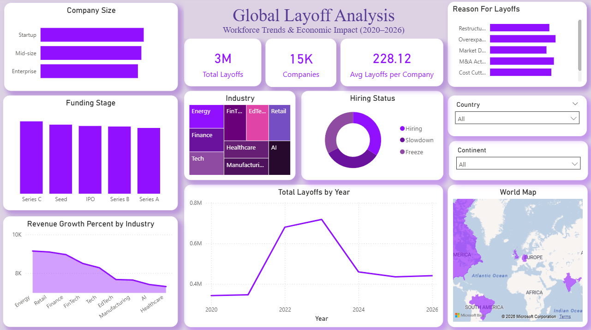

# Global Layoff Analysis Dashboard (2020–2026)

## Overview

This Power BI dashboard analyzes global workforce reductions from 2020 to 2026 across industries, funding stages, company sizes, and geographic regions. The report delivers interactive insights into layoff trends and economic impact.

## Key Highlights

- Analyzed 3M+ total layoffs across 15K+ companies  
- Identified 2023 as the peak layoff year  
- Compared industry-wise and funding-stage impact   
- Implemented proper time intelligence with a Date table  
- Designed interactive slicers for country, continent, and layoff reason  

## Tools & Skills

- Power BI Desktop  
- DAX  
- Data Modeling & Relationships  
- KPI Design & Conditional Formatting  
- Data Storytelling  

## Dashboard Preview

## Conclusion

The Global Layoff Analysis Dashboard provides a structured and data-driven view of workforce trends during economic fluctuations. By combining time intelligence, interactive filtering, and industry-level insights, the report highlights key patterns in layoffs, funding-stage risk, and revenue impact.  

The dashboard demonstrates strong business intelligence capabilities, including advanced DAX usage, data modeling, and executive-level storytelling.
